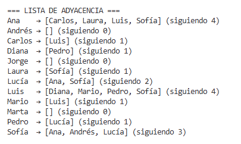
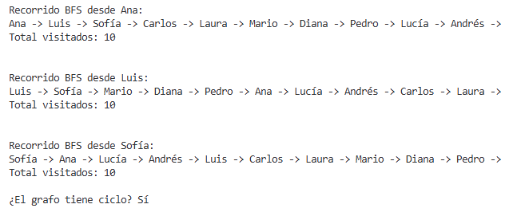
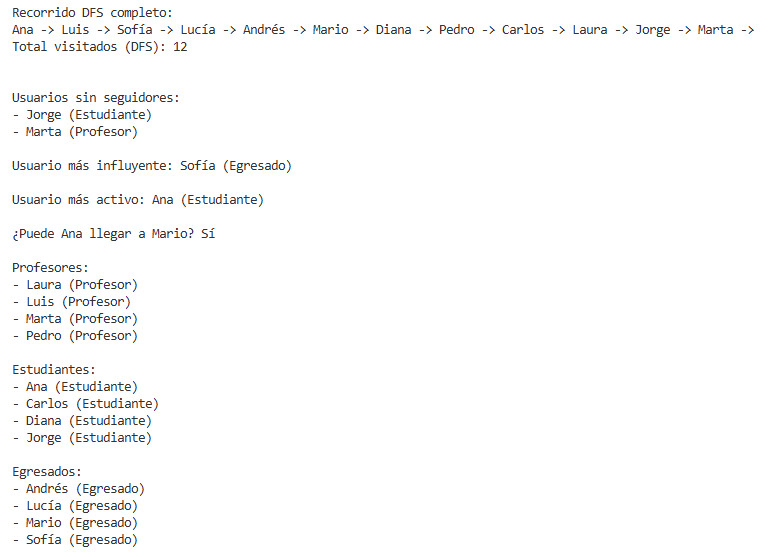

# Universidad de Manizales

Programación III

Actividad Colaborativa II: Taller Integrador – Grafos Dirigidos (MVC en C#)

Contexto: La Facultad desea un módulo interno que simule una red social dirigida de usuarios académicos, llamada CampusNet. Cada usuario puede seguir a otros usuarios, pero esa relación no necesariamente es recíproca.

## CampusNet — Grafos Dirigidos (MVC en C#)

## Integrantes

- MARIA CAMILA SAENZ VILLADA — Controller y Liderazgo
  - Coordina el proyecto y define casos de uso
  - Implementa GraphController y orquesta Modelo ↔ Vista
  - Asegura coherencia de flujos y mensajes
- SERGIO ALONSO ARBOLEDA SANCHEZ — Modelo (Lógica del grafo)
  - Diseña Graph, Vertex, Edge
  - Implementa BFS, DFS, detección de ciclos y métricas
  - Garantiza integridad del grafo
- ADELSON AGUIRRE RODRIGUEZ — Vista y Documentación
  - Implementa GraphView y mejora la salida en consola
  - Mantiene README y evidencia de ejecución
  - Facilita guía de uso

## Descripción

CampusNet simula una red social académica dirigida (usuarios siguen a otros usuarios). Implementado en C# con arquitectura MVC estricta:

- Model: `Vertex`, `Edge`, `Graph` con lista de adyacencia `Dictionary<string, List<string>>`.
- View: impresión en consola de estructura y resultados.
- Controller: orquestación de casos de uso.

## Requisitos Técnicos

- .NET Console App
- Grafo dirigido, sin duplicados (vértices/aristas), identificador único por vértice

## Instrucciones de Ejecución

1. Requisitos: SDK de .NET 8
2. Compilar:

   ```bash
   dotnet build
   ```

3. Ejecutar:

   ```bash
   dotnet run
   ```

## Guía de uso (qué verás al ejecutar)

- La lista de adyacencia muestra usuarios ordenados alfabéticamente, con sus seguidos también ordenados y el contador de seguidos.
- Los recorridos BFS/DFS imprimen el orden de visita y el total de nodos visitados.
- Se indica si el grafo tiene ciclo.
- Se listan consultas sociales ordenadas por nombre.

## Evidencia de Ejecución

### Lista de adyacencia (inicial)

```text
Ana    → [Carlos, Laura, Luis, Sofía] (siguiendo 4)
Andrés → [] (siguiendo 0)
Carlos → [Luis] (siguiendo 1)
Diana  → [Pedro] (siguiendo 1)
Jorge  → [] (siguiendo 0)
Laura  → [Sofía] (siguiendo 1)
Lucía  → [Ana, Sofía] (siguiendo 2)
Luis   → [Diana, Mario, Pedro, Sofía] (siguiendo 4)
Mario  → [Luis] (siguiendo 1)
Marta  → [] (siguiendo 0)
Pedro  → [Lucía] (siguiendo 1)
Sofía  → [Ana, Andrés, Lucía] (siguiendo 3)
```

### BFS (orden y cantidad)

```text
Recorrido BFS desde Ana:
Ana -> Luis -> Sofía -> Carlos -> Laura -> Mario -> Diana -> Pedro -> Lucía -> Andrés -> 
Total visitados: 10

Recorrido BFS desde Luis:
Luis -> Sofía -> Mario -> Diana -> Pedro -> Ana -> Lucía -> Andrés -> Carlos -> Laura -> 
Total visitados: 10

Recorrido BFS desde Sofía:
Sofía -> Ana -> Lucía -> Andrés -> Luis -> Carlos -> Laura -> Mario -> Diana -> Pedro -> 
Total visitados: 10
```

### DFS completo y ciclo

```text
¿El grafo tiene ciclo? Sí

Recorrido DFS completo:
Ana -> Luis -> Sofía -> Lucía -> Andrés -> Mario -> Diana -> Pedro -> Carlos -> Laura -> Jorge -> Marta -> 
Total visitados (DFS): 12
```

### Consultas sociales

```text
Usuario más influyente: Sofía (Egresado)

Usuario más activo: Ana (Estudiante)

¿Puede Ana llegar a Mario? Sí

Profesores:
- Laura (Profesor)
- Luis (Profesor)
- Marta (Profesor)
- Pedro (Profesor)

Estudiantes:
- Ana (Estudiante)
- Carlos (Estudiante)
- Diana (Estudiante)
- Jorge (Estudiante)

Egresados:
- Andrés (Egresado)
- Lucía (Egresado)
- Mario (Egresado)
- Sofía (Egresado)
```

### CRUD (resumen)

```text
=== CRUD ===
Agregado U13 y relación con Ana.

=== LISTA DE ADYACENCIA ===
Ana     → [Carlos, Laura, Luis, Sofía] (siguiendo 4)
...
Valeria → [Ana] (siguiendo 1)
Eliminada relación Ana → Luis.

=== LISTA DE ADYACENCIA ===
Ana     → [Carlos, Laura, Sofía] (siguiendo 3)
...
Valeria → [Ana] (siguiendo 1)
Actualizado nombre de U3.

=== LISTA DE ADYACENCIA ===
Ana         → [Carlos, Laura, Sofía Gómez] (siguiendo 3)
...
Sofía Gómez → [Ana, Andrés, Lucía] (siguiendo 3)
...
Eliminado U12.

=== LISTA DE ADYACENCIA ===
Ana         → [Carlos, Laura, Sofía Gómez] (siguiendo 3)
...
Sofía Gómez → [Ana, Lucía] (siguiendo 2)
...
Actualizado rol de U1 a Administrador.

Usuarios con rol Administrador:
- Ana (Administrador)
```

### Capturas de pantalla (opcional)

Inserta aquí capturas de la ejecución para acompañar la evidencia textual. Sugerencia de estructura de archivos:

```text
docs/
└─ evidencia/
   ├─ lista-adyacencia.png
   ├─ bfs-ana.png
   ├─ bfs-luis.png
   ├─ bfs-sofia.png
   ├─ dfs-completo.png
   └─ crud.png
```

Y referencia en Markdown (ejemplos):

```markdown



```

## Estructura del Proyecto

```text
CampusNet/
├─ Controller/
│  └─ GraphController.cs
├─ Model/
│  ├─ Edge.cs
│  ├─ Graph.cs
│  └─ Vertex.cs
├─ View/
│  └─ GraphView.cs
├─ Program.cs
└─ CampusNet.csproj
```

## Licencia

MIT
